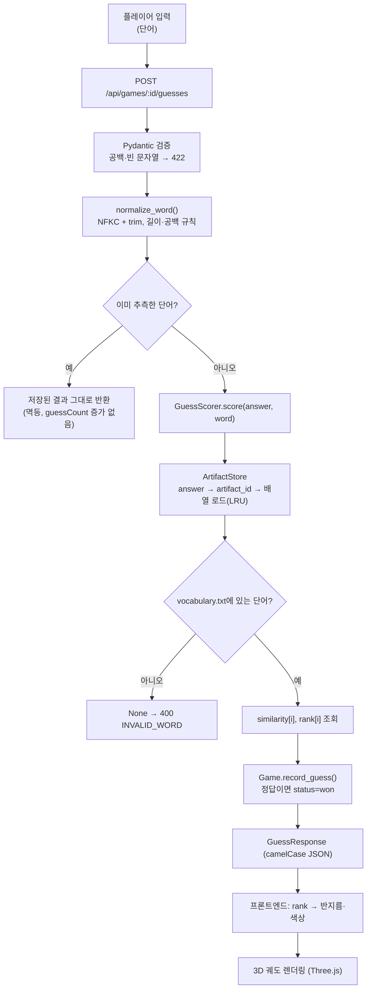
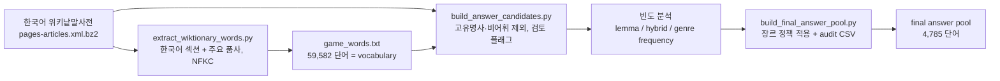
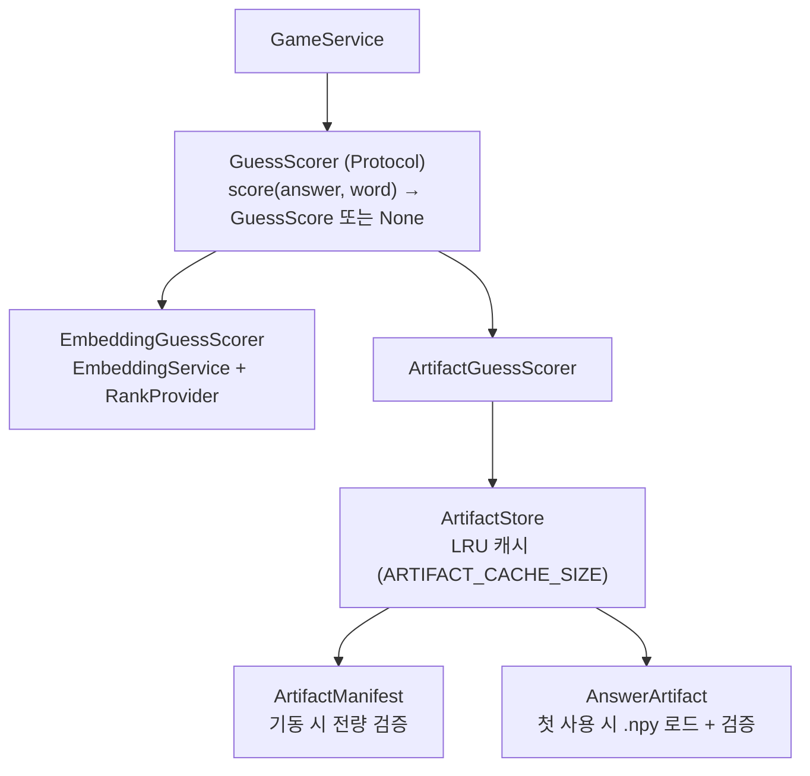
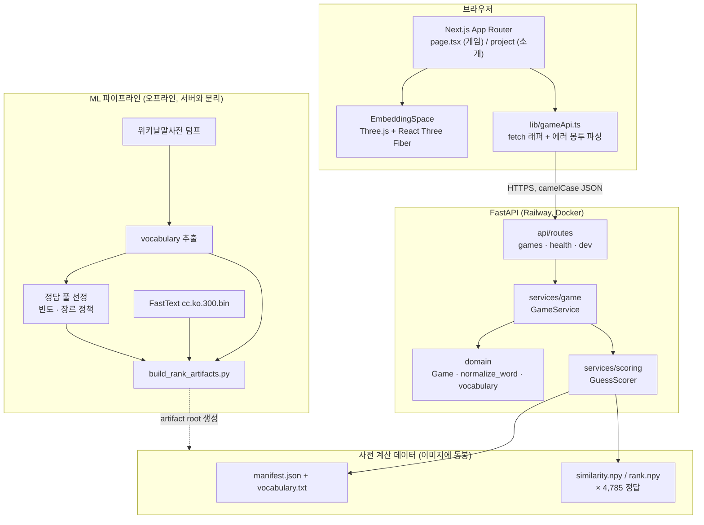
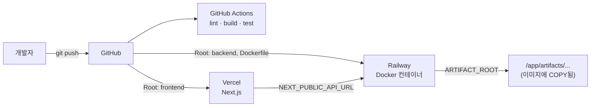

# Word Orbit

> **의미로 탐색하는 단어 추론 게임** — 철자가 아니라 *뜻*으로 정답에 다가가고,
> 그 과정을 3D 궤도(orbit)로 눈에 보이게 만든 웹 게임.

<!-- TODO: 대표 이미지 / 플레이 GIF 추가 (예: docs/assets/demo.gif) -->
<p align="center">
  <em>(대표 이미지 / 플레이 GIF placeholder)</em>
</p>

---

## Overview

Word Orbit은 꼬맨틀(Semantle)류의 **의미 기반 단어 추론 게임**입니다. 서버가 정답
단어 하나를 숨기고, 플레이어는 단어를 입력합니다. 서버는 정답과의 **코사인 유사도**와
전체 사전 안에서의 **순위(rank)** 를 돌려주고, 플레이어는 그 숫자를 단서로 의미 공간을
좁혀 나갑니다.

일반적인 꼬맨틀류와 다른 점은 결과를 **리스트가 아니라 우주(orbit)로 보여준다**는
것입니다. 정답은 화면 중심의 별이고, 추측한 단어들은 순위에 따라 정답 별에서 멀거나
가까운 궤도 위의 별로 배치됩니다. 순위가 좋을수록 중심에 가깝고, 별의 색(분광형)도
바뀝니다. "지금 내가 정답 주변 어디쯤 있는가"를 숫자 대신 거리감으로 읽을 수 있습니다.

기술적으로 이 프로젝트의 핵심은 **온라인/오프라인 ML 분리**입니다. 유사도와 순위는
FastText 한국어 벡터로 **미리, 오프라인에서** 전부 계산해 `.npy` 배열로 저장해 두고,
운영 서버는 임베딩 모델을 아예 로드하지 않은 채 그 배열의 한 칸만 읽습니다. 덕분에
멀티 GB 모델 없이도 정확히 동일한 점수를 상수 시간에 서빙할 수 있습니다.

전체 저장소는 `frontend` / `backend` / `ml` / `docs` 네 영역으로 나뉘며, 영역 사이의
접합면은 **HTTP API 계약**([docs/API_SPEC.md](./docs/API_SPEC.md))과 **rank artifact
포맷**([docs/ARTIFACT_FORMAT.md](./docs/ARTIFACT_FORMAT.md)) 두 가지 문서입니다.

## Demo

| 항목 | 주소 |
| --- | --- |
| 웹 (Vercel) | `TODO: 프로덕션 URL` |
| API (Railway) | `TODO: 백엔드 URL` |
| API 문서 | `TODO: <백엔드 URL>/docs` (FastAPI 자동 생성) |

<!-- TODO: 게임 화면 / 3D orbit 스크린샷 추가 -->
<p align="center">
  <em>(게임 화면 스크린샷 placeholder)</em>
</p>

## Why Word Orbit?

**문제의식.** Wordle류는 철자 게임이고, 꼬맨틀류는 의미 게임이지만 결과가 **숫자
리스트**로만 주어집니다. 플레이어는 "0.42가 0.38보다 낫다"는 것은 알아도, 자신이 의미
공간의 어느 방향을 이미 훑었는지, 정답이 어느 정도 거리에 있는지는 감이 오지 않습니다.

**꼬맨틀류에서 가져온 것.**

- 정답은 서버만 알고, 게임 중에는 절대 클라이언트로 나가지 않는다.
- 점수는 문자열 일치가 아니라 임베딩 벡터의 코사인 유사도다.
- 유사도만으로는 체감이 어렵기 때문에 전체 사전 기준 **순위**를 함께 준다.

**우리가 더한 것.**

| | 기존 꼬맨틀류 | Word Orbit |
| --- | --- | --- |
| 결과 표현 | 유사도 리스트 | 3D 궤도 + 리스트 |
| 거리 감각 | 숫자 비교 | 중심(정답)으로부터의 반지름 |
| 근접도 표현 | 텍스트 | 별의 분광형 색상 (O·B·A·F·G·K·M) |
| 종료 | 정답 맞히기 | 정답 맞히기 + **포기(give-up) 후 정답 공개** |
| 점수 계산 | 요청 시 모델 추론 | **오프라인 사전 계산 artifact 조회** |

## How It Works

플레이어가 단어를 입력한 뒤 화면에 별이 뜨기까지의 전체 경로입니다.



핵심 지점 세 가지:

- **정규화는 한 곳에서만.** [`normalize_word()`](./backend/app/domain/game.py)가 추측과
  정답 비교, artifact 조회에 모두 쓰입니다. 두 경로가 다르게 정규화되면 유사도 1.0인데
  정답으로 인정되지 않는 버그가 생기기 때문입니다.
- **모르는 단어는 거절.** artifact 모드에서는 사전(59,582단어)에 없는 단어에 점수가
  존재하지 않으므로 `400 INVALID_WORD`로 거절합니다. 반대로 라이브 모델 모드에서는 어떤
  문자열이든 벡터가 만들어지므로 거절되지 않습니다 — 같은 API, 다른 서버 구성입니다.
- **정답은 두 곳에서만 공개.** `GET /api/games/{id}`(게임 종료 후)와 give-up 응답,
  이 두 매퍼가 전부입니다([`schemas/game.py`](./backend/app/schemas/game.py)).

## 3D Visualization

> **중요:** 현재 화면은 300차원 임베딩 벡터를 3차원으로 차원 축소한 것이 **아닙니다.**
> 백엔드의 `coordinate` 필드는 아직 항상 `null`이고, 좌표는 프론트엔드가 `rank` 하나로
> 만들어냅니다.

구현은 [`EmbeddingSpace.tsx`](./frontend/src/features/game/EmbeddingSpace.tsx)에 있고,
좌표는 `position = direction(index) × radius(rank)` 로 결정됩니다.

| 구성 요소 | 의미 | 결정 방식 |
| --- | --- | --- |
| **원점 (0,0,0)** | 정답 별 | 항상 고정 |
| **반지름 (radius)** | 정답과의 의미적 근접도 | `rank`의 구간별 선형 보간 — **의미 있음** |
| **방향 (direction)** | 없음 | 추측 순번(index) 기반 황금각 배치 — **의미 없음** |
| **색상 (분광형)** | 근접도 등급 | `rank` 구간 → O·B·A·F·G·K·M |

**반지름 매핑** (`getRadiusByRank`)

| rank | 반지름 | 분광형 |
| --- | --- | --- |
| 1 ~ 100 | 1.1 → 1.8 | 1위는 `O`, 나머지는 `B` |
| 101 ~ 500 | 2.0 → 2.7 | A |
| 501 ~ 2,000 | 2.9 → 3.7 | F |
| 2,001 ~ 10,000 | 3.9 → 4.7 | G |
| 10,001 ~ 30,000 | 4.9 → 5.6 | K |
| 30,001 ~ 59,582 | 5.8 → 7.1 | M |
| `null` | 7.2 | M |

구간 안에서는 선형 보간이고, 30,001위 이상은 사전 크기(59,582)에서 잘립니다. 원점의
"정답" 별은 항상 표시되는 **기준점 마커**이며, 정답을 맞힌 추측(rank 1)은 반지름 1.1
위치에 자기 별로 놓입니다. `rank`가 `null`인 경우는 라이브 모델 모드에서만 발생합니다 —
artifact 모드에서는 순위를 매길 수 없는 단어를 애초에 거절하기 때문입니다.

**방향은 왜 의미가 없나.** 같은 rank 구간의 별들이 한 점에 겹치면 화면에서 구분이 안
됩니다. 그래서 방향은 추측 순번에 황금각(`π(3−√5)`)을 곱해 구면 위에 고르게 흩뿌리는
결정적(deterministic) 배치입니다. 같은 게임을 다시 열어도 같은 자리에 놓이지만,
**"오른쪽 위에 있다"는 사실은 그 단어의 의미에 대해 아무것도 말해주지 않습니다.**

이 구조는 의도적으로 교체 가능하게 되어 있습니다. 백엔드가 `coordinate {x,y,z}`를
채우기 시작하면 `getPosition()`의 분기 하나만 바꾸면 됩니다 (해당 코드에 주석으로
자리가 표시되어 있습니다). → [Future Work](#future-work)

## AI / ML

### 임베딩 모델

- **FastText `cc.ko.300.bin`** (한국어 Common Crawl + Wikipedia, 300차원 정적 단어 벡터).
- 선택 이유와 평가 계획: [docs/MODEL_EVALUATION.md](./docs/MODEL_EVALUATION.md).
  FastText는 **최종 모델 결정이 아니라 첫 번째 실제 베이스라인**입니다 — CPU 친화적이고
  subword 기반이라 미등록어에 강하지만, 정적 벡터라 문맥에 따른 동형이의어를 구분하지
  못합니다.
- 평가 하네스: `ml/scripts/evaluate_fasttext.py` + `ml/evaluation/` (v0.2 데이터셋,
  정답 20개 × `veryClose` / `related` / `unrelated` / `surfaceTrap` 4개 그룹, 엄격
  pairwise 정확도 5종과 Precision@k / Recall@k).

### 사전(vocabulary)과 정답 풀(answer pool)



- **사전**은 순위 계산의 기준 집합입니다. 59,582개 단어이고, 줄 순서 자체가 계약입니다
  (`similarity[i]`가 `vocabulary.txt`의 i번째 줄을 가리킴).
- **정답 풀**은 사전의 부분집합입니다. 위키낱말사전 후보(고유명사·비어휘 제외)에서
  시작해 실제 코퍼스 빈도를 붙이고, 후보 적격성 심사를 통과한 뒤 다시 **장르 정책**을
  적용합니다 — 장르 커버리지 ≥ 2, 빈도 백분위 mean·median ≥ 0.20
  ([`final_pool_selection.py`](./ml/src/contextle_eval/final_pool_selection.py)).
  두 조건을 모두 만족한 단어만 선정되고, 탈락 사유까지 audit CSV로 남습니다.
  결과: **4,785개 정답**.

### 오프라인 artifact 생성

`ml/scripts/build_rank_artifacts.py`가 정답 하나마다 사전 전체에 대한 배열 두 개를
계산해 저장합니다.

```
<root>/
├── manifest.json          # 스키마, 모델, 사전 해시, 정답 → artifact_id 매핑
├── vocabulary.txt         # 59,582줄, BOM 없음, NFKC, sha256이 manifest에 기록됨
└── artifacts/<id[:2]>/<id>/
    ├── similarity.npy     # float32 × 59,582  (238 KB)
    └── rank.npy           # uint16  × 59,582  (119 KB)
```

- `artifact_id = sha256(NFKC(answer).strip().encode("utf-8"))` — 정답 단어가 파일
  경로·스택트레이스·디렉터리 목록에 평문으로 나타나지 않게 하기 위한 **위생 조치**이지,
  암호학적 비밀 유지가 아닙니다 (`manifest.json`에는 정답이 평문으로 들어 있습니다).
- 순위 정책은 manifest에 명시되고 서버가 **정확히 일치할 때만** 서빙합니다:
  `{metric: cosine, answer_rank: 1, order: similarity_desc, tie_break: lexical}`.
  동점은 rank를 공유하지 않고 코드포인트 순으로 갈립니다.

### 운영 서버가 FastText를 로드하지 않는 이유

| | 라이브 모델 (`SCORING_PROVIDER=embedding`) | Artifact (`SCORING_PROVIDER=artifact`) |
| --- | --- | --- |
| 필요한 것 | `cc.ko.300.bin` (수 GB) + `fasttext` 라이브러리 | `.npy` 배열 + numpy |
| 순위 계산 | 매 추측마다 사전 전체 스캔 | 배열 인덱싱 1회 |
| 기동 시 | 모델 로드 + 사전 전체 임베딩 | manifest·사전 검증만 (배열은 지연 로드) |
| 미등록어 | 항상 점수가 나옴 | `400 INVALID_WORD` |
| 사용처 | 로컬 개발, 테스트, CI (결정적 mock) | **운영** |

배포 이미지에는 FastText 라이브러리조차 설치되지 않습니다 — 숫자는 이미 오프라인에서
계산됐고 numpy로 읽기만 하면 되기 때문입니다.

### Artifact scoring 아키텍처



`similarity`와 `rank`는 **하나의 조회로 함께** 반환됩니다. 두 값이 같은 배열 행에서
나오므로, 서로 다른 출처의 값이 나란히 보고되는 일이 구조적으로 불가능합니다.

읽어 들이는 모든 배열은 검증을 통과해야 합니다 — 형상/dtype이 manifest와 일치, 유사도가
유한하고 [-1, 1] 범위, 정답 자신의 유사도가 정확히 1.0, 정답의 rank가 1, 그리고 전체
rank가 1..N의 순열일 것. 서버는 모델이 없어 이 값들을 재계산할 수 없으므로, 신뢰하는
대신 확인합니다.

## System Architecture



**경계 규칙:** 백엔드는 `ml/` 을 절대 import 하지 않습니다. artifact 포맷은 양쪽에
독립적으로 구현되어 있고, 그래서 포맷 테스트가 의미를 가집니다.

## Key Features

- **의미 기반 추측** — 코사인 유사도(`[-1, 1]`)와 사전 전체 기준 순위를 함께 반환.
- **3D 궤도 시각화** — 정답 중심, 순위 기반 반지름, 분광형 색상, 궤도 회전/줌
  (`OrbitControls`), Bloom 포스트프로세싱, 선택한 단어와 중심을 잇는 선.
- **포기(give-up)** — 진행 중인 게임을 `abandoned`로 끝내고 정답을 공개. 포기는 추측이
  아니므로 `guessCount`가 늘지 않고, 이후 모든 추측은 `409`.
- **정답 비공개 보장** — 게임이 `playing`인 동안 정답은 응답에도 로그에도 나타나지
  않습니다. 전용 테스트(`test_answer_secrecy.py`, `test_artifact_secrecy.py`)가 이를 검사.
- **중복 추측 멱등** — 같은 단어를 다시 내면 저장된 결과가 그대로 반환되고 카운트는 그대로.
- **새로고침 복원** — `localStorage`의 gameId로 진행 중이던 게임과 추측 기록을 복원.
- **승리 연출** — 정답 시 confetti.
- **에러 봉투 통일** — 모든 오류가 `{code, message, details}` 형태. 처리되지 않은 예외도
  고정 문구로 치환되어 내부 정보가 새지 않습니다.
- **교체 가능한 점수 공급자** — `SCORING_PROVIDER` 환경변수 하나로 라이브 모델 ↔ 사전
  계산 artifact 전환. 호출부 코드는 그대로.

## Tech Stack

| 영역 | 기술 |
| --- | --- |
| **Frontend** | Next.js 16 (App Router), React 19, TypeScript, Tailwind CSS 4, React Compiler, Three.js, `@react-three/fiber`, `@react-three/drei`, `@react-three/postprocessing`, canvas-confetti |
| **Backend** | Python 3.12, FastAPI, Uvicorn, Pydantic v2, pydantic-settings, NumPy, uv, Ruff, pytest |
| **ML** | FastText (`cc.ko.300.bin`), NumPy, 한국어 위키낱말사전 덤프, 코퍼스 빈도 CSV |
| **Infra** | Docker / Docker Compose, GitHub Actions, Vercel (frontend), Railway (backend), Git LFS |

> `frontend/src/features/game/TechStack.tsx`에는 "Word2Vec / PCA"라는 초기 문구가
> 남아 있지만, 이 컴포넌트는 어디에서도 import되지 않는 Phase 0 스켈레톤 잔재입니다.
> 실제 구현은 FastText 기반이며 PCA 투영은 사용하지 않습니다. 이 README가 코드 기준입니다.

## Repository Structure

```text
.
├─ frontend/                     # Next.js 앱 (실제로 렌더링되는 경로만 표시)
│  └─ src/
│     ├─ app/page.tsx            # 게임 화면 전체 (입력·기록·상태·3D 배치)
│     ├─ app/project/page.tsx    # 프로젝트 소개 페이지
│     ├─ components/HelpModal    # 게임 방법 모달
│     ├─ features/game/EmbeddingSpace.tsx   # 3D 궤도 렌더링
│     ├─ lib/gameApi.ts          # 게임 API의 유일한 fetch 경계
│     └─ types/api.ts            # API 계약의 TypeScript 미러
│     # 그 밖의 features/·lib/api/ 파일은 Phase 0 스켈레톤 잔재로 현재 미사용
│
├─ backend/                      # FastAPI 서비스
│  ├─ app/
│  │  ├─ api/routes/             # games · health · dev (얇은 핸들러)
│  │  ├─ core/                   # config(환경변수), errors
│  │  ├─ domain/                 # 순수 게임 규칙 (Game, normalize_word, vocabulary)
│  │  ├─ schemas/                # camelCase 응답 모델 + 정답 공개 지점 2곳
│  │  └─ services/
│  │     ├─ embedding/           # Protocol + deterministic mock + FastText
│  │     ├─ ranking/             # 라이브 모드의 순위 계산
│  │     ├─ scoring/             # GuessScorer 접합면
│  │     │  └─ artifact/         # manifest·store·answer·paths·vocabulary 리더
│  │     └─ game/                # GameService, InMemoryGameRepository
│  ├─ artifacts/final/           # 운영 artifact root (4,785 정답, Git LFS)
│  ├─ artifacts/smoke/           # 배포 검증용 10 정답 root
│  └─ tests/                     # pytest
│
├─ ml/                           # 오프라인 실험 · 데이터 파이프라인
│  ├─ src/contextle_eval/        # rank_artifact, 빈도 분석, 정답 풀 선정 로직
│  ├─ scripts/                   # 재현 가능한 CLI (사전 추출 → 풀 선정 → artifact 빌드)
│  ├─ evaluation/                # 단어 유사도 평가 세트 (v0.2)
│  └─ tests/                     # pytest
│
└─ docs/                         # API_SPEC · ARTIFACT_FORMAT · ARCHITECTURE ·
                                 # DEPLOYMENT · MODEL_EVALUATION · PRODUCT · ROADMAP
```

## API

전체 명세는 **[docs/API_SPEC.md](./docs/API_SPEC.md)** 를 참고하세요. 요약:

| Method | Path | 설명 |
| --- | --- | --- |
| `GET` | `/health` | 헬스체크 (`{"status":"ok"}`) |
| `POST` | `/api/games` | 게임 생성. 정답은 서버가 고르고 응답에 **없음** |
| `POST` | `/api/games/{gameId}/guesses` | 추측 채점. 중복은 멱등 |
| `POST` | `/api/games/{gameId}/give-up` | 포기 + 정답 공개 |
| `GET` | `/api/games/{gameId}` | 게임 상태 + 추측 기록 (제출 순) |
| `POST` | `/api/dev/similarity` | 개발용 하네스 (게임 API 아님) |

**규약**

- JSON 필드는 **camelCase**. 백엔드는 내부적으로 snake_case를 쓰고 Pydantic alias로 변환.
- 시각은 ISO-8601 UTC (`2026-07-30T10:30:33Z`).
- 오류는 모두 `{"code": "...", "message": "...", "details": ...}` 봉투.
  코드: `INVALID_INPUT`(422) · `INVALID_WORD`(400) · `GAME_NOT_FOUND`(404) ·
  `GAME_ALREADY_FINISHED`(409) · `INTERNAL_ERROR`(500).

**추측 응답 형태** (숫자 값은 예시)

```json
{
  "guessId": "guess-001",
  "word": "학생",
  "similarity": 0.4213,
  "rank": 3721,
  "isAnswer": false,
  "coordinate": null
}
```

`coordinate`는 현재 항상 `null`입니다 — 3D 좌표는 프론트엔드가 `rank`로 계산합니다
([3D Visualization](#3d-visualization) 참고).

## Deployment Architecture



**이미지가 보장하는 것** ([`backend/Dockerfile`](./backend/Dockerfile))

- 배포 대상에 중립적 — Railway, artifact 경로, 프론트 오리진 중 어느 것도 이미지에
  박혀 있지 않고 전부 환경변수로 읽습니다.
- 플랫폼이 주는 `$PORT`에 바인딩하고, `exec`로 uvicorn이 직접 `SIGTERM`을 받습니다.
- **`--workers 1` 고정.** 게임 상태가 프로세스 메모리에 있어서(Redis/DB 없음) 워커가
  둘이 되면 한쪽에서 만든 게임이 다른 쪽에서 404가 됩니다. Railway 레플리카도 1이어야
  합니다.
- 비특권 사용자 `appuser`(uid/gid 10001)로 실행.

**주요 환경변수**

| 변수 | 용도 |
| --- | --- |
| `SCORING_PROVIDER` | `embedding`(기본) 또는 `artifact` |
| `ARTIFACT_ROOT` | artifact 모드에서 필수. 컨테이너 내부 절대경로 |
| `ARTIFACT_CACHE_SIZE` | 메모리에 유지할 정답 배열 수 (기본 64) |
| `FRONTEND_ORIGIN` | CORS 허용 오리진 목록 (쉼표 구분, 와일드카드 없음) |
| `NEXT_PUBLIC_API_URL` | 프론트엔드가 호출할 백엔드 주소 |

잘못된 `ARTIFACT_ROOT`는 기동 단계에서 프로세스를 죽입니다 — mock으로 조용히
degrade하지 않습니다. 즉 "떠 있는 서버 = root 검증을 통과한 서버"입니다.

**Git LFS.** 운영 artifact root(`backend/artifacts/final/`)는 9,570개의 `.npy` 파일,
정답당 약 349 KiB, 합계 약 **1.6 GiB**입니다. Docker `COPY`는 빌드 컨텍스트 밖을
읽을 수 없어 데이터가 저장소 안에 있어야 하고, 그래서 `.npy`는 Git LFS로 추적합니다.
`vocabulary.txt`는 sha256이 검증되는 바이트열이라 `.gitattributes`에서 `binary`로
지정해 CRLF 변환을 막습니다 — Windows에서 체크아웃만 해도 해시가 깨지기 때문입니다.

```bash
git clone <repo>
git lfs install
git lfs pull        # .npy 실체 내려받기
```

전체 배포 절차·검증 명령은 **[docs/DEPLOYMENT.md](./docs/DEPLOYMENT.md)** 에 있습니다.

> **참고:** `docs/DEPLOYMENT.md`는 smoke root(정답 10개) 기준으로 작성된 시점의 문서라,
> `final` root 패키징 이후의 운영 값은 아직 반영되어 있지 않습니다. 실제 Railway 설정값은
> 서비스 대시보드를 확인하세요. → [Future Work](#future-work)

## Testing

```bash
# 백엔드
cd backend && uv sync && uv run ruff check . && uv run pytest

# ML (별도 프로젝트 파일 없이 백엔드 환경을 재사용, conftest가 ml/src를 잡아줍니다)
uv run --project backend pytest ml/tests

# 프론트엔드
cd frontend && npm ci && npm run lint && npm run build
```

**현재 상태** (로컬 실행 결과)

| 스위트 | 결과 |
| --- | --- |
| `backend/tests` | **493 passed, 12 skipped** (skip = `fasttext` extra + 로컬 모델이 있어야 도는 `test_fasttext_integration.py`) |
| `ml/tests` | **214 passed, 1 skipped** |

**백엔드가 무엇을 검사하는가**

| 파일 | 검사 대상 |
| --- | --- |
| `test_games_api.py` | 게임 생성/추측/조회/포기 전 경로, 오류 코드와 상태 전이 |
| `test_answer_secrecy.py`, `test_artifact_secrecy.py` | 정답이 응답·로그·예외 메시지에 나타나지 않음 |
| `test_artifact_manifest.py` | manifest 검증 (스키마, 경로 파생, 사전 해시, dtype, 정답 인덱스) |
| `test_artifact_answer.py` | `.npy` 배열 검증 (형상·범위·정답 rank 1·순열 여부) |
| `test_artifact_runtime.py`, `test_artifact_store.py` | 실제 artifact root로 구동하는 종단 경로, LRU 캐시 |
| `test_scoring_factory.py` | 공급자 선택, 설정 바인딩, 정답 풀 적격성 |
| `test_ranking.py` | 순위 정책이 ML 하네스와 동일한지 (parity 테스트) |
| `test_game_domain.py`, `test_game_service.py` | 순수 게임 규칙, 멱등성, 종료 상태 |

**CI** ([`.github/workflows/ci.yml`](./.github/workflows/ci.yml)) — `paths-filter`로
변경 영역만 실행합니다. 프론트엔드는 `npm ci → lint → build`, 백엔드는
`uv sync → ruff → pytest`(항상 결정적 mock으로, 모델 다운로드 없음). ML 테스트와 Docker
이미지 빌드는 아직 CI에 포함되어 있지 않습니다.

## Team

**TEAM LOSSLESS** — Sogang University

| 이름 | 역할 |
| --- | --- |
| 김다솜 | `TODO: 역할` |
| 서희연 | `TODO: 역할` |
| 이수아 | `TODO: 역할` |

기여 방법과 브랜치/PR 규칙: [CONTRIBUTING.md](./CONTRIBUTING.md),
[docs/COLLABORATION.md](./docs/COLLABORATION.md).

## What We Learned / Technical Highlights

**1. 의미 유사도를 어떻게 "보여줄" 것인가**
300차원 벡터를 3차원으로 투영하면 거리가 왜곡되고, 왜곡된 거리를 정확한 유사도처럼
보여주면 플레이어를 속이게 됩니다. 그래서 우리는 **의미가 확실한 축 하나(순위 → 반지름)만
정보로 쓰고, 나머지 두 자유도는 겹침 방지용 배치로만 사용**하기로 했습니다. 화면은
정직해지고, 실제 좌표가 생기면 교체할 자리도 남습니다.

**2. 온라인/오프라인 ML 분리**
"모델을 서버에 올린다"가 유일한 선택지는 아니었습니다. 정답 풀이 유한하고(4,785개) 사전도
유한하니(59,582개), 모든 (정답, 단어) 쌍의 점수는 **오프라인에서 전부 계산 가능**합니다.
그 결과 운영 서버는 모델도, 딥러닝 라이브러리도, GPU도 필요 없고, 추측 처리가 배열
인덱싱 한 번이 됩니다. 대신 미등록어를 채점할 수 없다는 제약이 생기고, 이건 API 계약에
명시적으로 반영했습니다.

**3. 재계산할 수 없는 데이터를 신뢰하는 법**
서버는 모델이 없어서 `.npy` 값이 맞는지 스스로 확인할 방법이 없습니다. 그래서 신뢰 대신
검증을 택했습니다 — 사전의 sha256, manifest의 순위 정책 완전 일치, 파일 경로를 받는 대신
`artifact_id`에서 **재계산해서 비교**(경로 조작 차단), 배열 로드 시 범위·정답 rank·순열
검사. 잘못된 root는 첫 요청이 아니라 기동에서 죽습니다.

**4. 큰 바이너리 데이터의 배포**
1.6 GiB의 `.npy`를 Docker 빌드 컨텍스트 안에 두려면 저장소에 넣어야 하고, 저장소에 넣으려면
Git LFS가 필요합니다. 그 과정에서 배운 것: `vocabulary.txt`는 텍스트로 취급되는 순간
Windows `core.autocrlf`가 59,582줄에 CR을 붙여 sha256을 깨뜨립니다. `.gitattributes`의
`binary` 지정이 기능적 요구사항이 되는 경우입니다.

**5. API 계약을 문서가 아니라 코드로 지키기**
정답이 새지 않는다는 보장은 리뷰어의 주의력이 아니라 **구조**로 만들었습니다: 정답을 담은
응답 모델은 둘뿐이고, 각각 매퍼가 하나씩이며, 두 매퍼 모두 게임이 `playing`이 아닐 때만
값을 채웁니다. 검토해야 할 코드가 두 줄로 줄어들고, 그 두 줄에 테스트가 붙어 있습니다.

## Future Work

현재 **구현되지 않은** 항목들입니다.

- **실제 임베딩 좌표 (`coordinate`)** — PCA/UMAP 등으로 투영한 `{x,y,z}`를 백엔드가
  채우면 3D 방향도 의미를 갖게 됩니다. 프론트엔드 교체 지점은 이미 준비되어 있습니다.
- **탐색 경로 리플레이** — 추측 순서를 궤도 위의 경로로 그리기.
- **멀티플레이 (경쟁/협동)** — WebSocket 룸, Redis 룸 상태, Postgres 기록. API 후보
  스펙만 문서에 존재하고 코드는 없습니다.
- **게임 상태 영속화** — 현재는 프로세스 메모리라 재시작하면 사라지고, 이 때문에 워커·
  레플리카를 1로 고정해야 합니다.
- **문장 모드 + Attention 시각화** — 문장 임베딩 기반 유사도(Phase 4).
- **최종 모델 결정** — FastText는 베이스라인입니다. Transformer 계열 후보와의 비교는
  [docs/MODEL_EVALUATION.md](./docs/MODEL_EVALUATION.md)의 계획대로 진행 예정.
- **Vercel preview 배포 CORS** — 프리뷰마다 호스트명이 달라 정규식 오리진 허용이 필요합니다.
- **문서 최신화** — `docs/ARCHITECTURE.md`, `docs/ROADMAP.md`, `docs/DEPLOYMENT.md`,
  `docs/ARTIFACT_FORMAT.md`의 일부 상태 표기가 구현보다 뒤처져 있습니다. 저장소 내부
  명칭도 `Contextle`(초기 작업명)과 `Word Orbit`이 섞여 있습니다.
- **미사용 스켈레톤 정리** — `features/game/{EmbeddingScene, GameGuide, GuessForm,
  GuessHistory, ProjectIntroduction, TechStack}`, `components/OrbitStar`,
  `features/health/`, `lib/api/`는 현재 어디에서도 import되지 않습니다. 게임 화면은
  `app/page.tsx` 한 파일(1,300여 줄)에 모여 있어 분리 여지가 있습니다.
- **ML 테스트 / Docker 빌드 CI 편입**.

---

## 로컬 실행

자세한 내용: [docs/DEVELOPMENT.md](./docs/DEVELOPMENT.md)

**사전 준비** — Node 22 (`.nvmrc`), Python 3.12 (`.python-version`), uv, Git LFS.

```bash
# 0) 클론 직후
git config core.hooksPath .githooks
git lfs install && git lfs pull

# 1) 백엔드 (mock 모드 — 모델도 artifact도 불필요)
cd backend
uv sync
uv run uvicorn app.main:app --reload            # http://localhost:8000/docs

# 2) 프론트엔드 (다른 터미널)
cd frontend
npm install
cp .env.example .env.local                      # PowerShell: Copy-Item .env.example .env.local
npm run dev                                     # http://localhost:3000
```

**실제 점수로 플레이하려면** artifact 모드로 켭니다.

```bash
cd backend
SCORING_PROVIDER=artifact \
ARTIFACT_ROOT="$(pwd)/artifacts/final" \
uv run uvicorn app.main:app --reload
```

```powershell
# Windows PowerShell
$env:SCORING_PROVIDER = "artifact"
$env:ARTIFACT_ROOT = "$PWD\artifacts\final"
uv run uvicorn app.main:app --reload
```

Docker로 백엔드만 띄우려면 `docker compose up --build backend`.

## 문서

| 문서 | 내용 |
| --- | --- |
| [docs/API_SPEC.md](./docs/API_SPEC.md) | HTTP API 계약 (source of truth) |
| [docs/ARTIFACT_FORMAT.md](./docs/ARTIFACT_FORMAT.md) | rank artifact 온디스크 포맷 |
| [docs/DEPLOYMENT.md](./docs/DEPLOYMENT.md) | Vercel / Railway 배포 절차와 검증 |
| [docs/DEVELOPMENT.md](./docs/DEVELOPMENT.md) | 로컬 개발 환경 |
| [docs/MODEL_EVALUATION.md](./docs/MODEL_EVALUATION.md) | 임베딩 모델 평가 계획 |
| [docs/ARCHITECTURE.md](./docs/ARCHITECTURE.md) | 구조 개요 |
| [docs/PRODUCT.md](./docs/PRODUCT.md) · [docs/ROADMAP.md](./docs/ROADMAP.md) | 제품 정의 · 단계별 계획 |
| [AGENTS.md](./AGENTS.md) | AI 코딩 에이전트 작업 규칙 |
