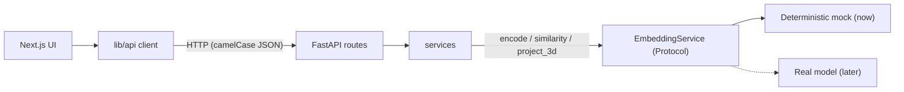

# Contextle

> **의미 기반 단어 추론 웹게임** — a semantic word-guessing game.
> Working name: **Contextle**. This repository is currently in **Phase 0**: a
> collaboration skeleton, not a playable game yet.

---

## 목차 / Table of contents

1. [프로젝트 소개](#1-프로젝트-소개--introduction)
2. [꼬맨틀형 게임이란](#2-꼬맨틀형-게임이란--how-the-game-works)
3. [프로젝트 목표](#3-프로젝트-목표--goals)
4. [핵심 차별점](#4-핵심-차별점--what-makes-it-different)
5. [수업 이론과의 연결](#5-수업-이론과의-연결--course-theory)
6. [현재 개발 단계](#6-현재-개발-단계--current-status)
7. [기술 스택](#7-기술-스택--tech-stack)
8. [아키텍처 개요](#8-아키텍처-개요--architecture)
9. [디렉터리 구조](#9-디렉터리-구조--directory-structure)
10. [로컬 실행 방법](#10-로컬-실행-방법--running-locally)
11. [환경변수](#11-환경변수--environment-variables)
12. [테스트 및 코드 검사](#12-테스트-및-코드-검사--tests--linting)
13. [협업 방식](#13-협업-방식--collaboration)
14. [브랜치 및 PR 규칙](#14-브랜치-및-pr-규칙--branch--pr-rules)
15. [배포 계획](#15-배포-계획--deployment-plan)
16. [로드맵](#16-로드맵--roadmap)
17. [문서 링크](#17-문서-링크--documentation)
18. [라이선스](#18-라이선스--license)

---

## 1. 프로젝트 소개 / Introduction

Contextle은 꼬맨틀(Semantle)과 유사한 **단어 추론 게임**입니다. 사용자가 단어를
입력하면 숨겨진 정답 단어와의 **의미적 유사도**를 돌려주고, 사용자는 지금까지의
결과를 바탕으로 정답을 추론합니다. 철자나 문자열 일치가 아니라 **Word Embedding
벡터 사이의 의미적 거리**를 사용한다는 점이 핵심입니다.

## 2. 꼬맨틀형 게임이란 / How the game works

- 정답 단어는 서버가 숨깁니다.
- 추측 단어를 입력하면 정답과의 **코사인 유사도**(및 이후 단계의 순위·좌표)를 받습니다.
- 유사도가 높을수록 의미적으로 가깝습니다. 점수 목록을 단서로 정답에 좁혀갑니다.
- 예: 정답이 "바다"라면 "해양"은 높게, "컴퓨터"는 낮게 나옵니다.

## 3. 프로젝트 목표 / Goals

- 단어 임베딩 기반 의미 유사도 게임.
- 추측 단어와 정답의 관계를 **3D 임베딩 공간**에 시각화.
- **실시간 멀티플레이**(경쟁/협동) 모드.
- 게임 후 **탐색 경로 리플레이**.
- 향후 **문장 임베딩 + Attention 시각화**로 확장.
- 수업에서 배운 개념(Embedding, 벡터 기하학, Softmax, Attention)을 실제 서비스와 연결.

## 4. 핵심 차별점 / What makes it different

- 단순 꼬맨틀 복제가 아니라 **의미 공간의 3D 탐색**을 보여줍니다.
- **교체 가능한 임베딩 인터페이스**로, 모델 선정 전에도 게임을 개발할 수 있습니다.
- 교육적 확장(문장 유사도, Attention)을 처음부터 로드맵에 포함합니다.

## 5. 수업 이론과의 연결 / Course theory

각 항목은 **구현 상태**를 함께 표시합니다 — ✅ 구현 완료 · 🚧 개발 중 · 📅 계획.

| 이론 | 게임에서의 역할 | 상태 |
| --- | --- | --- |
| **Word Embedding** | 단어를 고차원 벡터로 표현 | 🚧 (모의 임베딩 ✅ / 실제 모델 📅) |
| **Vector Geometry** | 코사인 유사도로 의미적 가까움을 계산 | ✅ (mock에서 동작) |
| **Energy & Softmax** | 유사도 점수의 상대적 분포 시각화 | 📅 |
| **Optimization** | 필요 시 임베딩 파인튜닝·손실 함수 실험 | 📅 |
| **Kernel** | 고정 커널 vs. 입력에 따라 달라지는 Attention 비교 | 📅 |
| **Attention** | 문맥에 따라 표현이 달라지는 원리 + 향후 시각화 | 📅 |

> 이론을 과장하지 않습니다. 현재 유사도는 **결정적 모의 임베딩**으로 계산되며,
> 의미적으로 정확하지 않습니다. 실제 모델은 [docs/MODEL_EVALUATION.md](./docs/MODEL_EVALUATION.md)
> 에 따라 선정합니다.

## 6. 현재 개발 단계 / Current status

**Phase 0 — 협업 환경 구축 (완료).** 지금 저장소가 제공하는 것:

- ✅ 백엔드 `/health`, 환경변수 기반 CORS, `EmbeddingService` 인터페이스 + 결정적 mock, 테스트.
- ✅ 프론트엔드 랜딩 페이지 + 백엔드 `/health` 실시간 연결 표시.
- ✅ 버전 고정, `.env.example`, 백엔드 Dockerfile + Compose, CI, 협업 문서.

아직 **게임 로직/UI, 멀티플레이, 3D, 실제 모델, DB는 없습니다.** → [ROADMAP](./docs/ROADMAP.md).

## 7. 기술 스택 / Tech stack

| 영역 | 사용 기술 |
| --- | --- |
| **Frontend** | Next.js 16 (App Router), TypeScript, Tailwind CSS, ESLint, React Compiler |
| **Backend** | Python 3.12, FastAPI, Uvicorn, Pydantic v2, pytest, Ruff, uv |
| **ML (later)** | sentence-transformers, PyTorch, scikit-learn (PCA→UMAP) — optional extra |
| **Infra** | Docker / Docker Compose, GitHub Actions; deploy: Vercel + Render/Railway |

## 8. 아키텍처 개요 / Architecture



세부 내용은 [docs/ARCHITECTURE.md](./docs/ARCHITECTURE.md).

## 9. 디렉터리 구조 / Directory structure

```text
.
├─ frontend/          # Next.js app (app/, components/, features/, lib/api/, types/)
├─ backend/           # FastAPI app (api/, core/, schemas/, services/, domain/) + tests
├─ ml/                # experiments: notebooks/, scripts/, evaluation/, data/
├─ docs/              # PRODUCT, ARCHITECTURE, API_SPEC, COLLABORATION, DEVELOPMENT, MODEL_EVALUATION, ROADMAP
├─ .github/           # CI workflow, PR & issue templates
├─ AGENTS.md          # rules for AI coding agents
├─ CONTRIBUTING.md    # contributor quickstart
├─ docker-compose.yml # backend (redis/postgres behind the `data` profile)
├─ .nvmrc             # Node 22
└─ .python-version    # Python 3.12
```

> **구조 참고:** 저장소는 이미 `frontend/ backend/ ml/ docs/`로 분리되어 있어
> 권장 구조와 일치합니다. 파일 이동으로 인한 위험을 피하기 위해 기존 구조를
> 그대로 유지했습니다 (README 하단 *구조 결정* 참고).

## 10. 로컬 실행 방법 / Running locally

**사전 준비:** Node ≥ 20.9 (권장 22), Python 3.12, (선택) uv·Docker.
자세한 내용은 [docs/DEVELOPMENT.md](./docs/DEVELOPMENT.md).

### 백엔드 / Backend

**Docker (권장):**

```bash
docker compose up --build backend      # http://localhost:8000/health
```

**Docker 없이 (uv):**

```bash
cd backend
uv sync
uv run uvicorn app.main:app --reload
```

<details>
<summary>uv 없이 (venv + pip)</summary>

**Windows PowerShell**

```powershell
cd backend
python -m venv .venv
.venv\Scripts\Activate.ps1
pip install fastapi "uvicorn[standard]" pydantic pydantic-settings pytest httpx ruff
uvicorn app.main:app --reload
```

**macOS / Linux**

```bash
cd backend
python -m venv .venv
source .venv/bin/activate
pip install fastapi "uvicorn[standard]" pydantic pydantic-settings pytest httpx ruff
uvicorn app.main:app --reload
```
</details>

### 프론트엔드 / Frontend (다른 터미널)

```bash
cd frontend
npm install
npm run dev                            # http://localhost:3000
```

env 예시 복사:

- **Windows PowerShell:** `Copy-Item .env.example .env.local`
- **macOS / Linux:** `cp .env.example .env.local`

<http://localhost:3000> 을 열면 **“Frontend is running”** 과 **Backend /health**
연결 표시가 보입니다. 백엔드가 켜져 있으면 표시가 초록색으로 바뀝니다.

## 11. 환경변수 / Environment variables

실제 `.env` 파일은 커밋하지 않습니다(무시됨). 예시 파일을 복사해 사용하세요.

**Frontend** ([`frontend/.env.example`](./frontend/.env.example))

```env
NEXT_PUBLIC_API_URL=http://localhost:8000
NEXT_PUBLIC_WS_URL=ws://localhost:8000
```

**Backend** ([`backend/.env.example`](./backend/.env.example))

```env
APP_ENV=development
FRONTEND_ORIGIN=http://localhost:3000
EMBEDDING_PROVIDER=mock
MODEL_NAME=
DATABASE_URL=
REDIS_URL=
```

## 12. 테스트 및 코드 검사 / Tests & linting

**Frontend**

```bash
cd frontend
npm run lint
npm run build
```

**Backend**

```bash
cd backend
uv run ruff check .
uv run pytest
```

CI는 프론트/백엔드 변경을 감지해 해당 검사만 실행하며, **무거운 ML 모델을
내려받지 않습니다**(테스트는 결정적 mock 사용).

## 13. 협업 방식 / Collaboration

프론트엔드·백엔드·ML이 서로 기다리지 않고 병렬로 개발합니다. 경계와 절차는
[docs/COLLABORATION.md](./docs/COLLABORATION.md), AI 에이전트 규칙은
[AGENTS.md](./AGENTS.md)를 참고하세요.

## 14. 브랜치 및 PR 규칙 / Branch & PR rules

- `main`은 항상 실행·배포 가능. 직접 push 금지, PR 필수, **최소 1인 승인 + CI 통과**.
- 브랜치: `feature/<issue>-<name>`, `fix/…`, `docs/…`, `chore/…`.
- 커밋: Conventional Commits (`feat:`, `fix:`, `docs:`, `test:`, `refactor:`, `chore:`).
- **Squash merge** 후 브랜치 삭제.

> **브랜치 보호 규칙은 GitHub UI에서 직접 설정**해야 합니다(이 저장소/에이전트가
> 대신 설정하지 않습니다). 항목은 [docs/COLLABORATION.md](./docs/COLLABORATION.md#branch-protection-configure-in-github-ui) 참고.

## 15. 배포 계획 / Deployment plan

- **Frontend → Vercel.**
- **Backend → Render 또는 Railway** (Docker 이미지).
- **Redis/PostgreSQL**은 멀티플레이·기록 기능(Phase 3)에서 관리형 애드온으로 추가.
- 아직 실제 배포는 구성하지 않았습니다(계획 단계).

## 16. 로드맵 / Roadmap

Phase 0 협업 환경 ✅ → 1 싱글플레이 MVP → 2 3D 시각화 → 3 멀티플레이 →
4 문장·Attention → 5 평가·파인튜닝 → 6 배포 안정화. 완료 조건은
[docs/ROADMAP.md](./docs/ROADMAP.md).

## 17. 문서 링크 / Documentation

- [PRODUCT](./docs/PRODUCT.md) · [ARCHITECTURE](./docs/ARCHITECTURE.md) ·
  [API_SPEC](./docs/API_SPEC.md) · [COLLABORATION](./docs/COLLABORATION.md)
- [DEVELOPMENT](./docs/DEVELOPMENT.md) · [MODEL_EVALUATION](./docs/MODEL_EVALUATION.md) ·
  [ROADMAP](./docs/ROADMAP.md)
- [AGENTS.md](./AGENTS.md) · [CONTRIBUTING.md](./CONTRIBUTING.md) ·
  [frontend/README](./frontend/README.md) · [backend/README](./backend/README.md) ·
  [ml/README](./ml/README.md)

## 18. 라이선스 / License

**추후 결정 (TBD).** 라이선스를 정하기 전까지는 팀 내부 사용을 전제로 합니다.
모델·데이터셋 사용 시 각자의 라이선스를 반드시 확인하세요
([docs/MODEL_EVALUATION.md](./docs/MODEL_EVALUATION.md)).

---

### 구조 결정 / Structure decision (note)

새 팀원을 위해: 이 저장소는 이미 `frontend/ backend/ ml/ docs/`로 분리되어 있고,
프론트엔드 코드가 루트가 아닌 `frontend/`에 있었기 때문에 **파일 이동 없이 기존
구조를 유지**하고 나머지(`backend`, `ml`, `docs`, 루트 설정)를 보완했습니다.
Git 기록이나 설정을 복잡하게 만들 이동을 피하기 위한 선택입니다.
