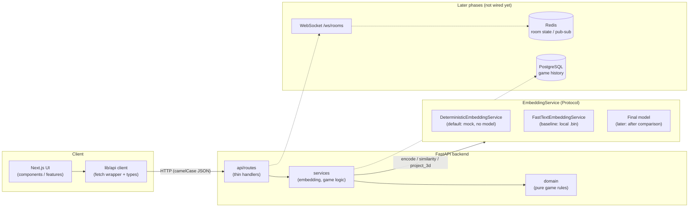
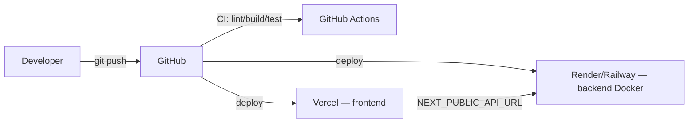

# Architecture

Contextle is a monorepo with three independently developed areas — **frontend**,
**backend**, and **ml** — plus shared **docs**. The seams between them are the
[API contract](./API_SPEC.md) and the `EmbeddingService` Protocol.

## High-level view

Dashed = planned. Solid = implemented in the Phase 0 skeleton.

## Components

### Frontend (`frontend/`)

- **Next.js 16 (App Router) + TypeScript + Tailwind + React Compiler.**
- `app/` routes & layouts; `components/` presentational UI; `features/`
  feature-scoped UI; `lib/api/` the only place `fetch` happens; `types/` shared
  wire types mirroring the API.
- Renders game state; talks to the backend exclusively through `lib/api`. No
  model math in the browser.

### Backend (`backend/`)

- **FastAPI + Uvicorn + Pydantic (v2) + pydantic-settings.**
- `api/routes` stay thin (validate → call service → shape response).
- `services/` holds business logic and the embedding integration.
- `domain/` (placeholder) will hold pure, framework-free game rules
  (answer selection, guess evaluation, win conditions) so they're unit-testable.
- `core/config.py` centralizes env-driven settings; CORS origins are
  configuration, never hard-coded `*`.

### Embedding service (the key seam)

- Defined as a `Protocol` (`services/embedding/base.py`): `encode`,
  `encode_many`, `similarity`, `project_3d`.
- **Default:** `DeterministicEmbeddingService` — hash-based, dependency-free,
  stable per input. Tests and CI always run on this; no model is ever downloaded.
- **Baseline:** `FastTextEmbeddingService` — a local FastText `.bin` given by
  `FASTTEXT_MODEL_PATH`, loaded **once** during app startup and injected through
  `api/deps.py`. `project_3d` raises `NotImplementedError` until Phase 2.
- **Later:** the final model chosen via
  [MODEL_EVALUATION.md](./MODEL_EVALUATION.md), added as one more
  implementation. Swapping providers is an env-var change
  (`EMBEDDING_PROVIDER`) with no caller edits.

### Data stores

- **None required today.** The skeleton is stateless.
- **Redis** (Phase 3): room state / real-time fan-out for multiplayer.
- **PostgreSQL** (Phase 3+): persistent game history & replays.
- Both are declared behind a Compose `data` profile so they never run by default.

### Real-time (Phase 3)

- `WS /ws/rooms/{roomId}` with a typed event envelope (see
  [API_SPEC.md](./API_SPEC.md)). Redis pub/sub coordinates multiple server
  instances if needed.

## Deployment (planned)

- **Frontend → Vercel.** **Backend → Render or Railway** (Docker image).
- Redis/Postgres added as managed add-ons when their phase arrives.

## Cross-cutting rules

- Model logic never leaks into routers or React components.
- The answer word never leaves the server before reveal (not in responses, not
  in logs).
- Contract changes update `API_SPEC.md` + backend schemas + frontend types together.
